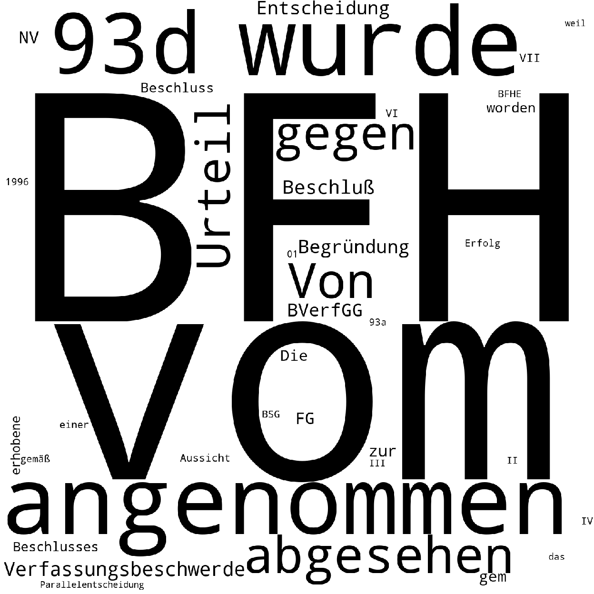
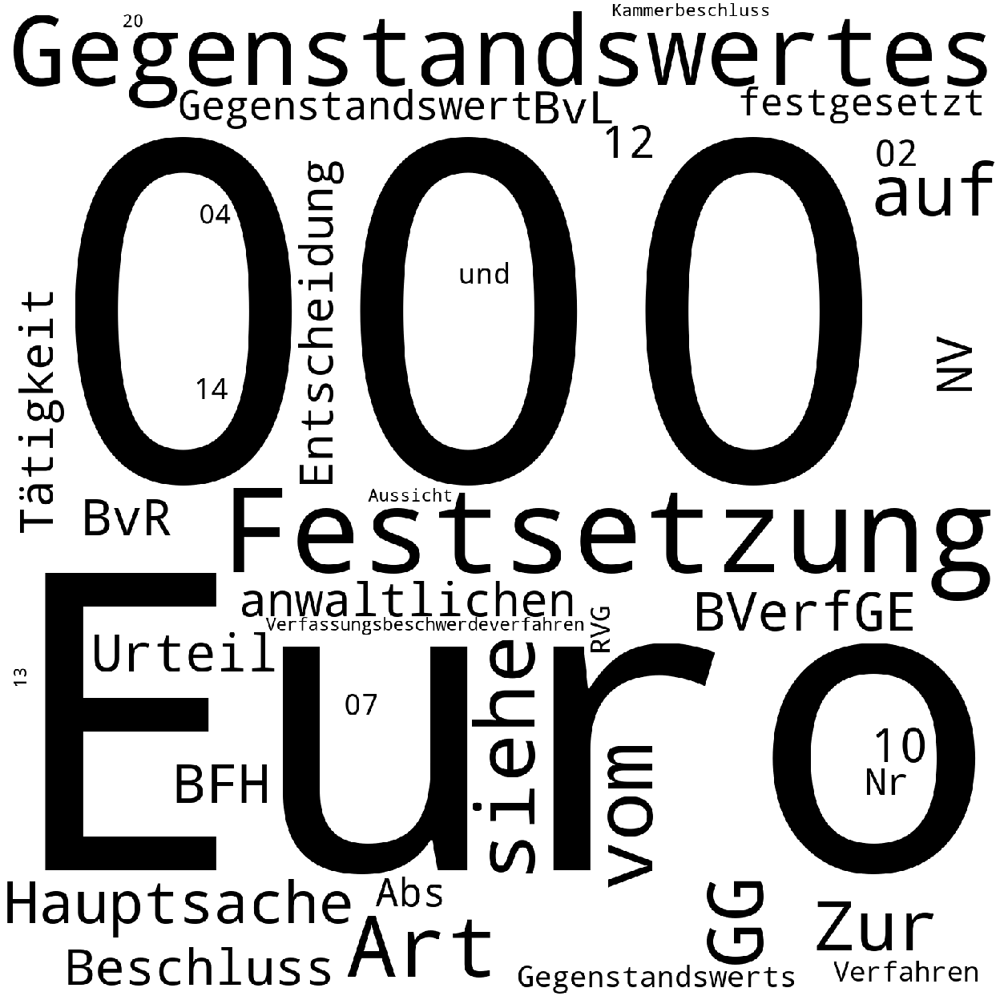

# german-legal-data
0. install [git-lfs](https://git-lfs.github.com/)  
    0. `curl -s https://packagecloud.io/install/repositories/github/git-lfs/script.deb.sh | sudo bash`
    0. `sudo apt-get install git-lfs`
    0. `git lfs install`
    
1. clone repo `https://github.com/dertilo/german-legal-data.git`
1. `pip install -r requirements.txt`
2. start elasticsearch with `cd elasticsearch_index && docker-compose up -d`
3. populate es-index: `python bverfg_to_es.py`  
    `populating es-index with 16197 documents took: 10.25 seconds`

### fun with elasticsearch + kibana
* following numbers are calculated on `Entscheidungen des Bundesverfassungsgerichts`, see [BverfG.jsonl.gz](BverfG.jsonl.gz)
* count fields: `python count_fields.py`
```shell script
                          field  count
8                  aktenzeichen  16197
9                          date  16197
10           entscheidungsdatum  16197
11                     subtitle  16197
12                        title  16197
13                          url  16197
14              zitiervorschlag  16197
4             Orientierungssatz  14274
2                        Gründe  12965
7                         Tenor   7155
3                      Leitsatz   2770
5   Sonstiger Orientierungssatz    475
0           Abweichende Meinung    179
1           Entscheidungsgründe      2
6                    Tatbestand      2
```

#### kibana console
+ before 1990
```shell script
 GET /bverfg/_count
    {
      "query": {
        "range": {
          "date": {
            "lte": "1990-01-01"
          }
        }
      }
    }

```
-> `"count" : 4592`

```shell script
GET /bverfg/_search
{
  "query": {
    "match_phrase": {
      "Gründe": "Verfassungswidrigkeit"
    }
  },
  "_source": {"includes": "Gründe"}, 
  "size": 20
}
```
-> `2161` decisions

* get index-size: `sudo du -sh /var/lib/docker/volumes/elasticsearch_index_esdata1/_data`

# [Latent Semantic Analysis on 'Orientierungsatz'](latent_semantic_analysis.py)
* not sure whether these wordclouds make any sense

### dimension 0 

### dimension 1 

### dimension 6 
